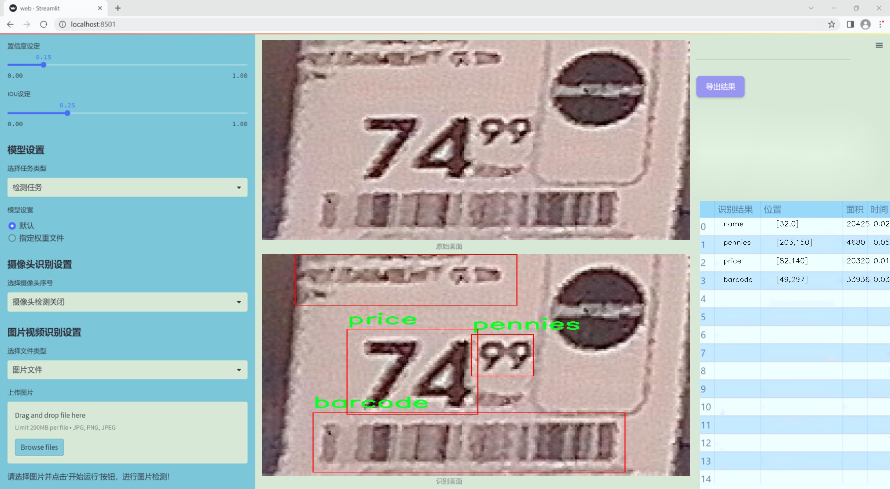
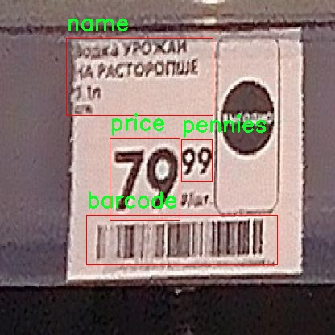

# 改进yolo11-ELA-HSFPN等200+全套创新点大全：价格标签检测系统源码＆数据集全套

### 1.图片效果展示




##### 项目来源 **[人工智能促进会 2024.11.01](https://kdocs.cn/l/cszuIiCKVNis)**

注意：由于项目一直在更新迭代，上面“1.图片效果展示”和“2.视频效果展示”展示的系统图片或者视频可能为老版本，新版本在老版本的基础上升级如下：（实际效果以升级的新版本为准）

  （1）适配了YOLOV11的“目标检测”模型和“实例分割”模型，通过加载相应的权重（.pt）文件即可自适应加载模型。

  （2）支持“图片识别”、“视频识别”、“摄像头实时识别”三种识别模式。

  （3）支持“图片识别”、“视频识别”、“摄像头实时识别”三种识别结果保存导出，解决手动导出（容易卡顿出现爆内存）存在的问题，识别完自动保存结果并导出到tempDir中。

  （4）支持Web前端系统中的标题、背景图等自定义修改。

  另外本项目提供训练的数据集和训练教程,暂不提供权重文件（best.pt）,需要您按照教程进行训练后实现图片演示和Web前端界面演示的效果。

### 2.视频效果展示

[2.1 视频效果展示](https://www.bilibili.com/video/BV1hvDPYAErV/)

### 3.背景

研究背景与意义

随着电子商务和零售行业的迅猛发展，价格标签的自动检测与识别在商品管理、库存控制和顾客服务等方面变得愈发重要。传统的人工价格标签识别方式不仅效率低下，而且容易受到人为因素的影响，导致错误率上升。因此，基于计算机视觉的自动价格标签检测系统应运而生，成为提升零售业运营效率的重要工具。近年来，YOLO（You Only Look Once）系列目标检测算法因其高效性和实时性，逐渐成为物体检测领域的研究热点。特别是YOLOv11版本的推出，进一步提升了检测精度和速度，为复杂场景下的物体识别提供了新的解决方案。

本研究旨在基于改进的YOLOv11算法，构建一个高效的价格标签检测系统。数据集的构建是实现这一目标的关键环节。我们使用的“pricetag”数据集包含71张图像，涵盖了多种价格标签的类别，包括条形码、商品名称、价格等信息。尽管数据集规模相对较小，但其多样性和代表性为模型的训练提供了良好的基础。通过对数据集的精细标注和处理，我们能够有效提升模型对不同类型价格标签的识别能力。

在此背景下，改进YOLOv11算法将通过引入更先进的特征提取网络和优化的损失函数，提升模型在复杂环境下的鲁棒性和准确性。该研究不仅具有重要的理论价值，还将为实际应用提供切实可行的解决方案，推动零售行业的智能化发展。通过实现自动化的价格标签检测，我们能够降低人工成本，提高工作效率，同时提升顾客的购物体验，为未来的智能零售铺平道路。

### 4.数据集信息展示

##### 4.1 本项目数据集详细数据（类别数＆类别名）

nc: 4
names: ['barcode', 'name', 'pennies', 'price']


该项目为【目标检测】数据集，请在【训练教程和Web端加载模型教程（第三步）】这一步的时候按照【目标检测】部分的教程来训练

##### 4.2 本项目数据集信息介绍

本项目数据集信息介绍

本项目所使用的数据集名为“pricetag”，旨在为改进YOLOv11的价格标签检测系统提供强有力的支持。该数据集专注于价格标签的各个组成部分，涵盖了四个主要类别，分别是条形码（barcode）、商品名称（name）、零钱（pennies）和价格（price）。这些类别的选择反映了价格标签的基本构成，能够有效地帮助模型学习和识别价格标签的各个要素。

数据集中的条形码类别包含了多种不同风格和格式的条形码图像，确保模型能够适应各种实际应用场景。商品名称类别则提供了多样化的商品名称图像，涵盖了不同字体、颜色和背景的变体，以增强模型对商品信息的识别能力。零钱类别则专注于展示不同面额的硬币图像，帮助模型理解价格标签中可能出现的零钱信息。最后，价格类别则包含了各种价格标识的图像，确保模型能够准确识别和提取价格信息。

为了确保数据集的多样性和广泛适用性，所有图像均经过精心挑选和标注，确保每个类别的样本数量均衡，且覆盖了不同的拍摄角度、光照条件和背景环境。这种多样性不仅提高了模型的鲁棒性，还增强了其在实际应用中的准确性和可靠性。通过使用“pricetag”数据集，研究团队期望能够显著提升YOLOv11在价格标签检测任务中的性能，使其在商业和零售领域的应用更加广泛和有效。





### 5.全套项目环境部署视频教程（零基础手把手教学）

[5.1 所需软件PyCharm和Anaconda安装教程（第一步）](https://www.bilibili.com/video/BV1BoC1YCEKi/?spm_id_from=333.999.0.0&vd_source=bc9aec86d164b67a7004b996143742dc)


[5.2 安装Python虚拟环境创建和依赖库安装视频教程（第二步）](https://www.bilibili.com/video/BV1ZoC1YCEBw?spm_id_from=333.788.videopod.sections&vd_source=bc9aec86d164b67a7004b996143742dc)

### 6.改进YOLOv11训练教程和Web_UI前端加载模型教程（零基础手把手教学）

[6.1 改进YOLOv11训练教程和Web_UI前端加载模型教程（第三步）](https://www.bilibili.com/video/BV1BoC1YCEhR?spm_id_from=333.788.videopod.sections&vd_source=bc9aec86d164b67a7004b996143742dc)


按照上面的训练视频教程链接加载项目提供的数据集，运行train.py即可开始训练



     Epoch   gpu_mem       box       obj       cls    labels  img_size
     1/200     20.8G   0.01576   0.01955  0.007536        22      1280: 100%|██████████| 849/849 [14:42<00:00,  1.04s/it]
               Class     Images     Labels          P          R     mAP@.5 mAP@.5:.95: 100%|██████████| 213/213 [01:14<00:00,  2.87it/s]
                 all       3395      17314      0.994      0.957      0.0957      0.0843

     Epoch   gpu_mem       box       obj       cls    labels  img_size
     2/200     20.8G   0.01578   0.01923  0.007006        22      1280: 100%|██████████| 849/849 [14:44<00:00,  1.04s/it]
               Class     Images     Labels          P          R     mAP@.5 mAP@.5:.95: 100%|██████████| 213/213 [01:12<00:00,  2.95it/s]
                 all       3395      17314      0.996      0.956      0.0957      0.0845

     Epoch   gpu_mem       box       obj       cls    labels  img_size
     3/200     20.8G   0.01561    0.0191  0.006895        27      1280: 100%|██████████| 849/849 [10:56<00:00,  1.29it/s]
               Class     Images     Labels          P          R     mAP@.5 mAP@.5:.95: 100%|███████   | 187/213 [00:52<00:00,  4.04it/s]
                 all       3395      17314      0.996      0.957      0.0957      0.0845


###### [项目数据集下载链接](https://kdocs.cn/l/cszuIiCKVNis)

### 7.原始YOLOv11算法讲解


其实到了YOLOV11 基本创新点就不太多了，主要就是大家互相排列组合复用不同的网络模块、损失函数和样本匹配策略，需要注意YOLO V5、V8 V11
都是1个公司的，其余的个人建议看看V8的，剩下的了解就好。

V11支持多种视觉任务：物体检测、实例分割、图像分类、姿态估计和定向物体检测（OBB）。

##### YOLOv11
基本和YOLOV8同源，甚至git目前都是1个，部分代码注释还是YOLOV8的，所以建议先看我写的YOLOV8相关博客，对比YOLOV8主要涉及到：

*backbone 中的使用C2f模块 变为 c3k2 模块。

*backbone 中的最后一层（sppf层）后增加了C2PSA模块。

*head 解耦头中的分类检测头两个Conv 变为 DWConv。

整体技术而言：

*backbone 使用了C2K2模块+最后SPPF模块级联C2PSA模块；

*neck 使用PAN结构，并且里面也使用C3K2模块；

*head使用了anchor-free + Decoupled-head，其中回归头使用正常的卷积，分类头使用DWConv；

*损失函数使用了分类BCE、回归CIOU + VFL的组合；

*框匹配策略由静态匹配改为了Task-Aligned Assigner匹配方式；

*训练策略没有提及，其中YOLOV8可以参考如下最后 10 个 epoch 关闭 Mosaic 的操作、训练总 epoch 数从 300 提升到了 500。

##### 主要思路


配置文件：[ultralytics/ultralytics/cfg/models/11/yolo11.yaml at main ·
ultralytics/ultralytics ·
GitHub](https://github.com/ultralytics/ultralytics/blob/main/ultralytics/cfg/models/11/yolo11.yaml
"ultralytics/ultralytics/cfg/models/11/yolo11.yaml at main ·
ultralytics/ultralytics · GitHub")

解析函数：[ultralytics/ultralytics/nn/tasks.py at main · ultralytics/ultralytics ·
GitHub](https://github.com/ultralytics/ultralytics/blob/main/ultralytics/nn/tasks.py#L934
"ultralytics/ultralytics/nn/tasks.py at main · ultralytics/ultralytics ·
GitHub")


##### 具体细节

##### input

输入要求以及预处理，可选项比较多，可以参考这个配置文件：[ultralytics/ultralytics/cfg/default.yaml at main
· ultralytics/ultralytics ·
GitHub](https://github.com/ultralytics/ultralytics/blob/main/ultralytics/cfg/default.yaml
"ultralytics/ultralytics/cfg/default.yaml at main · ultralytics/ultralytics ·
GitHub") 的Hyperparameters 部分。

基础输入仍然为640*640。预处理就是熟悉的letterbox（根据参数配置可以为不同的缩放填充模式，主要用于resize到640）+
转换rgb、chw、int8(0-255)->float（0-1），注意没有归一化操作。需要注意的是作者实现的mosaic和网上看到的不同，对比如下图（左边网上版本，右边是YOLO的实现）。并且作者添加了在最后10轮关闭mosaic增强（YOLOV8开始支持，具体原因个人的经验如我的这篇文章：yolov5
mosaic相关，关闭参数在 Train settings 部分的close_mosaic 选项）


##### backbone

主干网络以及改进

这里不去特意强调对比YOLOv5、V8等等的改进，因为各个系列都在疯狂演进，个人认为没必要花费时间看差异，着重看看一些比较重要的模块即可。源代码：

大多数模块：[ultralytics/ultralytics/nn/modules/block.py at main ·
ultralytics/ultralytics ·
GitHub](https://github.com/ultralytics/ultralytics/blob/main/ultralytics/nn/modules/block.py
"ultralytics/ultralytics/nn/modules/block.py at main · ultralytics/ultralytics
· GitHub")

head 部分：[ultralytics/ultralytics/nn/modules/head.py at main ·
ultralytics/ultralytics ·
GitHub](https://github.com/ultralytics/ultralytics/blob/main/ultralytics/nn/modules/head.py
"ultralytics/ultralytics/nn/modules/head.py at main · ultralytics/ultralytics
· GitHub")

串联模块构造网络：[ultralytics/ultralytics/nn/tasks.py at main ·
ultralytics/ultralytics ·
GitHub](https://github.com/ultralytics/ultralytics/blob/main/ultralytics/nn/tasks.py
"ultralytics/ultralytics/nn/tasks.py at main · ultralytics/ultralytics ·
GitHub")

##### 1）CBS 模块（后面叫做Conv）

就是pytorch 自带的conv + BN +SiLU，这里对应上面的配置文件的Conv 的 args 比如[64, 3, 2] 就是 conv2d
的c2=64、k=3、 s =2、c1 自动为上一层参数、p 为自动计算，真实需要计算scales 里面的with 和 max_channels 缩放系数。

这里连续使用两个3*3卷积stride为2的CBS模块直接横竖各降低了4倍分辨率（整体变为原来1/16）。这个还是比较猛的，敢在如此小的感受野下连续两次仅仅用一层卷积就下采样,当然作为代价它的特征图还是比较厚的分别为16、32。


    
    
        class Conv(nn.Module):
        """Standard convolution with args(ch_in, ch_out, kernel, stride, padding, groups, dilation, activation)."""
    
        default_act = nn.SiLU()  # default activation
    
        def __init__(self, c1, c2, k=1, s=1, p=None, g=1, d=1, act=True):
            """Initialize Conv layer with given arguments including activation."""
            super().__init__()
            self.conv = nn.Conv2d(c1, c2, k, s, autopad(k, p, d), groups=g, dilation=d, bias=False)
            self.bn = nn.BatchNorm2d(c2)
            self.act = self.default_act if act is True else act if isinstance(act, nn.Module) else nn.Identity()
    
        def forward(self, x):
            """Apply convolution, batch normalization and activation to input tensor."""
            return self.act(self.bn(self.conv(x)))
    
        def forward_fuse(self, x):
            """Perform transposed convolution of 2D data."""
            return self.act(self.conv(x))

##### 2）c3k2 模块

##### Bottleneck

有两种结构，需要参数shortcut和两个conv的宽度是否相同来控制。

##### C3 & C3K

都是CSP bottleneck module with 3 convolutions, C3 代表3个卷积层，
K代表其中bottleneck中的卷积核为支持自定义，其实这里c3k作者使用的默认的3*3卷积核也就等同于使用c3(c3是3*3卷积核)。

##### c2f & c3k2

其实也就是仿照YOLOv7 的ELAN
结构，通过更多的分支夸层链接，丰富了模型的梯度流。C3K2模块其实就是C2F模块转变出来的，它代码中有一个设置，就是当c3k这个参数为FALSE的时候，C3K2模块就是C2F模块，也就是说它的Bottleneck是普通的Bottleneck；反之当它为true的时候，将Bottleneck模块替换成C3K模块。模块中存在
Split 等操作对特定硬件部署没有之前那么友好了。需要针对自己的硬件进行测试看对最终推理速度的影响。

可视化关系如下，这里需要注意配置文件中的参数，比如21行[-1, 2, C3k2, [512, False, 0.25]]
512代表宽度、false代表是否使用shortcut、0.25代表c2f的宽度缩放。也就是第一个Conv的输出宽度。


源代码如下:

    
    
    class Bottleneck(nn.Module):
        """Standard bottleneck."""
    
        def __init__(self, c1, c2, shortcut=True, g=1, k=(3, 3), e=0.5):
            """Initializes a standard bottleneck module with optional shortcut connection and configurable parameters."""
            super().__init__()
            c_ = int(c2 * e)  # hidden channels
            self.cv1 = Conv(c1, c_, k[0], 1)
            self.cv2 = Conv(c_, c2, k[1], 1, g=g)
            self.add = shortcut and c1 == c2
    
        def forward(self, x):
            """Applies the YOLO FPN to input data."""
            return x + self.cv2(self.cv1(x)) if self.add else self.cv2(self.cv1(x))
    
    class C3(nn.Module):
        """CSP Bottleneck with 3 convolutions."""
    
        def __init__(self, c1, c2, n=1, shortcut=True, g=1, e=0.5):
            """Initialize the CSP Bottleneck with given channels, number, shortcut, groups, and expansion values."""
            super().__init__()
            c_ = int(c2 * e)  # hidden channels
            self.cv1 = Conv(c1, c_, 1, 1)
            self.cv2 = Conv(c1, c_, 1, 1)
            self.cv3 = Conv(2 * c_, c2, 1)  # optional act=FReLU(c2)
            self.m = nn.Sequential(*(Bottleneck(c_, c_, shortcut, g, k=((1, 1), (3, 3)), e=1.0) for _ in range(n)))
    
        def forward(self, x):
            """Forward pass through the CSP bottleneck with 2 convolutions."""
            return self.cv3(torch.cat((self.m(self.cv1(x)), self.cv2(x)), 1))
    
    class C3k(C3):
        """C3k is a CSP bottleneck module with customizable kernel sizes for feature extraction in neural networks."""
    
        def __init__(self, c1, c2, n=1, shortcut=True, g=1, e=0.5, k=3):
            """Initializes the C3k module with specified channels, number of layers, and configurations."""
            super().__init__(c1, c2, n, shortcut, g, e)
            c_ = int(c2 * e)  # hidden channels
            # self.m = nn.Sequential(*(RepBottleneck(c_, c_, shortcut, g, k=(k, k), e=1.0) for _ in range(n)))
            self.m = nn.Sequential(*(Bottleneck(c_, c_, shortcut, g, k=(k, k), e=1.0) for _ in range(n)))
    
    class C2f(nn.Module):
        """Faster Implementation of CSP Bottleneck with 2 convolutions."""
    
        def __init__(self, c1, c2, n=1, shortcut=False, g=1, e=0.5):
            """Initializes a CSP bottleneck with 2 convolutions and n Bottleneck blocks for faster processing."""
            super().__init__()
            self.c = int(c2 * e)  # hidden channels
            self.cv1 = Conv(c1, 2 * self.c, 1, 1)
            self.cv2 = Conv((2 + n) * self.c, c2, 1)  # optional act=FReLU(c2)
            self.m = nn.ModuleList(Bottleneck(self.c, self.c, shortcut, g, k=((3, 3), (3, 3)), e=1.0) for _ in range(n))
    
        def forward(self, x):
            """Forward pass through C2f layer."""
            y = list(self.cv1(x).chunk(2, 1))
            y.extend(m(y[-1]) for m in self.m)
            return self.cv2(torch.cat(y, 1))
    
        def forward_split(self, x):
            """Forward pass using split() instead of chunk()."""
            y = list(self.cv1(x).split((self.c, self.c), 1))
            y.extend(m(y[-1]) for m in self.m)
            return self.cv2(torch.cat(y, 1))
    
    class C3k2(C2f):
        """Faster Implementation of CSP Bottleneck with 2 convolutions."""
    
        def __init__(self, c1, c2, n=1, c3k=False, e=0.5, g=1, shortcut=True):
            """Initializes the C3k2 module, a faster CSP Bottleneck with 2 convolutions and optional C3k blocks."""
            super().__init__(c1, c2, n, shortcut, g, e)
            self.m = nn.ModuleList(
                C3k(self.c, self.c, 2, shortcut, g) if c3k else Bottleneck(self.c, self.c, shortcut, g) for _ in range(n)
            )

##### 3）sppf 模块

对比spp，将简单的并行max pooling 改为串行+并行的方式。对比如下（左边是SPP，右边是SPPF）：


    
    
        class SPPF(nn.Module):
        # Spatial Pyramid Pooling - Fast (SPPF) layer for YOLOv5 by Glenn Jocher
        def __init__(self, c1, c2, k=5):  # equivalent to SPP(k=(5, 9, 13))
            super().__init__()
            c_ = c1 // 2  # hidden channels
            self.cv1 = Conv(c1, c_, 1, 1)
            self.cv2 = Conv(c_ * 4, c2, 1, 1)
            self.m = nn.MaxPool2d(kernel_size=k, stride=1, padding=k // 2)
    
        def forward(self, x):
            x = self.cv1(x)
            with warnings.catch_warnings():
                warnings.simplefilter('ignore')  # suppress torch 1.9.0 max_pool2d() warning
                y1 = self.m(x)
                y2 = self.m(y1)
                return self.cv2(torch.cat((x, y1, y2, self.m(y2)), 1))

##### 4）C2PSA 模块

C2PSA它结合了PSA(Pointwise Spatial
Attention)块，用于增强特征提取和注意力机制。下面的图建议从左到右看，这样才能更有条理的理解，其实PSA个人感觉就是仿着VIT
的Attention来做的，是把输入C2PSA的特征图的h*w 看做VIT 的path数（也可以理解为NLP中token 个数），特征图的channel
数看做VIT特征维度（CNN的宽度，或者理解为NLP中token
编码后的特征维度），然后计算出QKV（这里需要注意第四幅图的QKV是值，不是操作，所以标注成了圆角矩形，这里是为了大家好理解），这里的Attention其实是在h*w维度计算空间Attention，个人感觉是强制给了全局感受野，并且并联了一个3*3的深度可分离卷积的单空间部分，就是仅在每一个特征图上进行3*3卷积，具体实现是通过pytorch
conv2d 的
group参数设置为特征图的通道数。特别的关于Conv的参数分别为：输入通道数、输出通道数、卷积核尺寸、pad尺寸、group数、是否有激活函数（默认silu）。图中的最后一幅省略了一些细节，可以参考源码。

注意区别C2fPSA，C2fPSA才是对 C2f 模块的扩展，通过在标准 C2f 模块中引入 PSA
块，C2fPSA实现了更强大的注意力机制，从而提高了模型对重要特征的捕捉能力。作者实现了该模块但最终没有使用。


涉及的源码：

    
    
    class Attention(nn.Module):
        """
        Attention module that performs self-attention on the input tensor.
    
        Args:
            dim (int): The input tensor dimension.
            num_heads (int): The number of attention heads.
            attn_ratio (float): The ratio of the attention key dimension to the head dimension.
    
        Attributes:
            num_heads (int): The number of attention heads.
            head_dim (int): The dimension of each attention head.
            key_dim (int): The dimension of the attention key.
            scale (float): The scaling factor for the attention scores.
            qkv (Conv): Convolutional layer for computing the query, key, and value.
            proj (Conv): Convolutional layer for projecting the attended values.
            pe (Conv): Convolutional layer for positional encoding.
        """
    
        def __init__(self, dim, num_heads=8, attn_ratio=0.5):
            """Initializes multi-head attention module with query, key, and value convolutions and positional encoding."""
            super().__init__()
            self.num_heads = num_heads
            self.head_dim = dim // num_heads
            self.key_dim = int(self.head_dim * attn_ratio)
            self.scale = self.key_dim**-0.5
            nh_kd = self.key_dim * num_heads
            h = dim + nh_kd * 2
            self.qkv = Conv(dim, h, 1, act=False)
            self.proj = Conv(dim, dim, 1, act=False)
            self.pe = Conv(dim, dim, 3, 1, g=dim, act=False)
    
        def forward(self, x):
            """
            Forward pass of the Attention module.
    
            Args:
                x (torch.Tensor): The input tensor.
    
            Returns:
                (torch.Tensor): The output tensor after self-attention.
            """
            B, C, H, W = x.shape
            N = H * W
            qkv = self.qkv(x)
            q, k, v = qkv.view(B, self.num_heads, self.key_dim * 2 + self.head_dim, N).split(
                [self.key_dim, self.key_dim, self.head_dim], dim=2
            )
    
            attn = (q.transpose(-2, -1) @ k) * self.scale
            attn = attn.softmax(dim=-1)
            x = (v @ attn.transpose(-2, -1)).view(B, C, H, W) + self.pe(v.reshape(B, C, H, W))
            x = self.proj(x)
            return x
    
    class PSABlock(nn.Module):
        """
        PSABlock class implementing a Position-Sensitive Attention block for neural networks.
    
        This class encapsulates the functionality for applying multi-head attention and feed-forward neural network layers
        with optional shortcut connections.
    
        Attributes:
            attn (Attention): Multi-head attention module.
            ffn (nn.Sequential): Feed-forward neural network module.
            add (bool): Flag indicating whether to add shortcut connections.
    
        Methods:
            forward: Performs a forward pass through the PSABlock, applying attention and feed-forward layers.
    
        Examples:
            Create a PSABlock and perform a forward pass
            >>> psablock = PSABlock(c=128, attn_ratio=0.5, num_heads=4, shortcut=True)
            >>> input_tensor = torch.randn(1, 128, 32, 32)
            >>> output_tensor = psablock(input_tensor)
        """
    
        def __init__(self, c, attn_ratio=0.5, num_heads=4, shortcut=True) -> None:
            """Initializes the PSABlock with attention and feed-forward layers for enhanced feature extraction."""
            super().__init__()
    
            self.attn = Attention(c, attn_ratio=attn_ratio, num_heads=num_heads)
            self.ffn = nn.Sequential(Conv(c, c * 2, 1), Conv(c * 2, c, 1, act=False))
            self.add = shortcut
    
        def forward(self, x):
            """Executes a forward pass through PSABlock, applying attention and feed-forward layers to the input tensor."""
            x = x + self.attn(x) if self.add else self.attn(x)
            x = x + self.ffn(x) if self.add else self.ffn(x)
            return x
        
    class C2PSA(nn.Module):
        """
        C2PSA module with attention mechanism for enhanced feature extraction and processing.
    
        This module implements a convolutional block with attention mechanisms to enhance feature extraction and processing
        capabilities. It includes a series of PSABlock modules for self-attention and feed-forward operations.
    
        Attributes:
            c (int): Number of hidden channels.
            cv1 (Conv): 1x1 convolution layer to reduce the number of input channels to 2*c.
            cv2 (Conv): 1x1 convolution layer to reduce the number of output channels to c.
            m (nn.Sequential): Sequential container of PSABlock modules for attention and feed-forward operations.
    
        Methods:
            forward: Performs a forward pass through the C2PSA module, applying attention and feed-forward operations.
    
        Notes:
            This module essentially is the same as PSA module, but refactored to allow stacking more PSABlock modules.
    
        Examples:
            >>> c2psa = C2PSA(c1=256, c2=256, n=3, e=0.5)
            >>> input_tensor = torch.randn(1, 256, 64, 64)
            >>> output_tensor = c2psa(input_tensor)
        """
    
        def __init__(self, c1, c2, n=1, e=0.5):
            """Initializes the C2PSA module with specified input/output channels, number of layers, and expansion ratio."""
            super().__init__()
            assert c1 == c2
            self.c = int(c1 * e)
            self.cv1 = Conv(c1, 2 * self.c, 1, 1)
            self.cv2 = Conv(2 * self.c, c1, 1)
    
            self.m = nn.Sequential(*(PSABlock(self.c, attn_ratio=0.5, num_heads=self.c // 64) for _ in range(n)))
    
        def forward(self, x):
            """Processes the input tensor 'x' through a series of PSA blocks and returns the transformed tensor."""
            a, b = self.cv1(x).split((self.c, self.c), dim=1)
            b = self.m(b)
            return self.cv2(torch.cat((a, b), 1))

##### 3、neck & head

##### 1）检测头

YOLOV11 Head 部分和YOLOV8是近似的，所以简单对比YOLOV5、V8、V11。


如上面图，上边是YOLOV5 的结构，中是YOLOv8 的结构，下面是YOLOV11 结构

Yolov5: 检测和分类共用一个卷积（coupled head）并且是anchor based ,其 卷积输出为（5+N class）*3，其中
5为bbox 四个值（具体代表什么不同版本略有不同，官方git有说明，历史版本见 目标检测算法——YOLOV5 ）+ 一个obj 值
（是否有目标，这个是从YOLO V1 传承下来的，个人感觉有点绕和不合理，并且后面取消），N class 为类别数，3为anchor 的数量，默认是3个。

YOLOv8：检测和分类的卷积是解耦的（decoupled），如中图，上面一条卷积支路是回归框，框的特征图channel为4*regmax，关于这个regmax
后面我们详细的解释,并不是anchor；分类的channel 为类别数。

YOLOV11：检测和分类的卷积是解耦的（decoupled），如右图，上面一条卷积支路是回归框，框的特征图channel为4*regmax，关于这个regmax
后面我们详细的解释,并不是anchor；分类的channel 为类别数，分类使用深度可分离卷积替代常规卷积降低计算量。

源码部分如下

    
    
    class Detect(nn.Module):
        """YOLO Detect head for detection models."""
    
        dynamic = False  # force grid reconstruction
        export = False  # export mode
        end2end = False  # end2end
        max_det = 300  # max_det
        shape = None
        anchors = torch.empty(0)  # init
        strides = torch.empty(0)  # init
    
        def __init__(self, nc=80, ch=()):
            """Initializes the YOLO detection layer with specified number of classes and channels."""
            super().__init__()
            self.nc = nc  # number of classes
            self.nl = len(ch)  # number of detection layers
            self.reg_max = 16  # DFL channels (ch[0] // 16 to scale 4/8/12/16/20 for n/s/m/l/x)
            self.no = nc + self.reg_max * 4  # number of outputs per anchor
            self.stride = torch.zeros(self.nl)  # strides computed during build
            c2, c3 = max((16, ch[0] // 4, self.reg_max * 4)), max(ch[0], min(self.nc, 100))  # channels
            self.cv2 = nn.ModuleList(
                nn.Sequential(Conv(x, c2, 3), Conv(c2, c2, 3), nn.Conv2d(c2, 4 * self.reg_max, 1)) for x in ch
            )
            self.cv3 = nn.ModuleList(
                nn.Sequential(
                    nn.Sequential(DWConv(x, x, 3), Conv(x, c3, 1)),
                    nn.Sequential(DWConv(c3, c3, 3), Conv(c3, c3, 1)),
                    nn.Conv2d(c3, self.nc, 1),
                )
                for x in ch
            )
            self.dfl = DFL(self.reg_max) if self.reg_max > 1 else nn.Identity()
    
            if self.end2end:
                self.one2one_cv2 = copy.deepcopy(self.cv2)
                self.one2one_cv3 = copy.deepcopy(self.cv3)
    
        def forward(self, x):
            """Concatenates and returns predicted bounding boxes and class probabilities."""
            if self.end2end:
                return self.forward_end2end(x)
    
            for i in range(self.nl):
                x[i] = torch.cat((self.cv2[i](x[i]), self.cv3[i](x[i])), 1)
            if self.training:  # Training path
                return x
            y = self._inference(x)
            return y if self.export else (y, x)

因此主要的变化可以认为有三个：（1）coupled head -> decoupled head ；（2）obj 分支消失；（3）anchor
based——> anchor free ; 4) 深度可分离卷积。

（1）coupled head -> decoupled head

这个解耦操作，看YOLO x 的论文，约有1% 的提升。逻辑和实现都比较直观易懂，不再赘述。

（2）obj 分支消失；

这个其实我自己再看YOLO V1 的时候就有疑问，它存在的意义。后来人们发现，其实obj
的在训练和推理过程中存在逻辑不一致性。具体而言（摘自“<https://zhuanlan.zhihu.com/p/147691786>”）

A。用法不一致。训练的时候，分类和质量估计各自训练自个儿的，但测试的时候却又是乘在一起作为NMS score排序的依据，这个操作显然没有end-to-
end，必然存在一定的gap。（个人认为还好，就是两个监督信号）

B。对象不一致。借助Focal
Loss的力量，分类分支能够使得少量的正样本和大量的负样本一起成功训练，但是质量估计通常就只针对正样本训练。那么，对于one-
stage的检测器而言，在做NMS
score排序的时候，所有的样本都会将分类score和质量预测score相乘用于排序，那么必然会存在一部分分数较低的“负样本”的质量预测是没有在训练过程中有监督信号的，对于大量可能的负样本，他们的质量预测是一个未定义行为。这就很有可能引发这么一个情况：一个分类score相对低的真正的负样本，由于预测了一个不可信的极高的质量score，而导致它可能排到一个真正的正样本（分类score不够高且质量score相对低）的前面。问题一如图所示：


（3）anchor based——> anchor free

这里主要涉及怎么定义回归内容以及如何匹配GT框的问题。也就是如下：

##### 2）匹配策略

A。回归的内容当前版本就是回归的lftp四个值（这四个值是距离匹配到的anchor 点的距离值！不是图片的绝对位置）。后面推理阶段通过
dist2bbox函数转换为需要的格式：

[
https://github.com/ultralytics/ultralytics/blob/cc3c774bde86ffce694d202b7383da6cc1721c1b/ultralytics/nn/modules.py#L378](https://github.com/ultralytics/ultralytics/blob/cc3c774bde86ffce694d202b7383da6cc1721c1b/ultralytics/nn/modules.py#L378
"  
 https://github.com/ultralytics/ultralytics/blob/cc3c774bde86ffce694d202b7383da6cc1721c1b/ultralytics/nn/modules.py#L378")

[
https://github.com/ultralytics/ultralytics/blob/cc3c774bde86ffce694d202b7383da6cc1721c1b/ultralytics/yolo/utils/tal.py#L196](https://github.com/ultralytics/ultralytics/blob/cc3c774bde86ffce694d202b7383da6cc1721c1b/ultralytics/yolo/utils/tal.py#L196
"  
 https://github.com/ultralytics/ultralytics/blob/cc3c774bde86ffce694d202b7383da6cc1721c1b/ultralytics/yolo/utils/tal.py#L196")。

    
    
       def dist2bbox(distance, anchor_points, xywh=True, dim=-1):
        """Transform distance(ltrb) to box(xywh or xyxy)."""
        lt, rb = torch.split(distance, 2, dim)
        x1y1 = anchor_points - lt
        x2y2 = anchor_points + rb
        if xywh:
            c_xy = (x1y1 + x2y2) / 2
            wh = x2y2 - x1y1
            return torch.cat((c_xy, wh), dim)  # xywh bbox
        return torch.cat((x1y1, x2y2), dim)  # xyxy bbox

##### B.匹配策略

YOLOv5 采用静态的匹配策略，V8采用了动态的TaskAlignedAssigner，其余常见的动态匹配还有： YOLOX 的 simOTA、TOOD
的 TaskAlignedAssigner 和 RTMDet 的 DynamicSoftLabelAssigner。


TaskAligned使用分类得分和IoU的高阶组合来衡量Task-Alignment的程度。使用上面公式来对每个实例计算Anchor-level
的对齐程度：s 和 u 分别为分类得分和 IoU 值，α 和 β 为权重超参。t 可以同时控制分类得分和IoU 的优化来实现 Task-
Alignment，可以引导网络动态的关注于高质量的Anchor。采用一种简单的分配规则选择训练样本：对每个实例，选择m个具有最大t值的Anchor作为正样本，选择其余的Anchor作为负样本。然后，通过损失函数(针对分类与定位的对齐而设计的损失函数)进行训练。

代码地址：[ultralytics/ultralytics/yolo/utils/tal.py at
c0c0c138c12699807ff9446f942cb3bd325d670b · ultralytics/ultralytics ·
GitHub](https://github.com/ultralytics/ultralytics/blob/c0c0c138c12699807ff9446f942cb3bd325d670b/ultralytics/yolo/utils/tal.py#L56
"ultralytics/ultralytics/yolo/utils/tal.py at
c0c0c138c12699807ff9446f942cb3bd325d670b · ultralytics/ultralytics · GitHub")

默认参数如下（当前版本这些超参没有提供修改的接口，如需修改需要在源码上进行修改）：


##### 4、loss function

损失函数设计

Loss 计算包括 2 个分支： 分类和回归分支，没有了之前的 objectness 分支。

分类分支依然采用 BCE Loss。回归分支使用了 Distribution Focal Loss（DFL Reg_max默认为16）+ CIoU
Loss。3 个 Loss
采用一定权重比例加权即可（默认如下：<https://github.com/ultralytics/ultralytics/blob/main/ultralytics/yolo/configs/default.yaml#L83>）。


这里重点介绍一下DFL损失。目前被广泛使用的bbox表示可以看作是对bbox方框坐标建模了单一的狄拉克分布。但是在复杂场景中，一些检测对象的边界并非十分明确。如下图左面所示，对于滑板左侧被水花模糊，引起对左边界的预测分布是任意而扁平的，对右边界的预测分布是明确而尖锐的。对于这个问题，有学者提出直接回归一个任意分布来建模边界框，使用softmax实现离散的回归，将狄拉克分布的积分形式推导到一般形式的积分形式来表示边界框。


狄拉克分布可以认为在一个点概率密度为无穷大，其他点概率密度为0，这是一种极端地认为离散的标签时绝对正确的。


因为标签是一个离散的点，如果把标签认为是绝对正确的目标，那么学习出的就是狄拉克分布，概率密度是一条尖锐的竖线。然而真实场景，物体边界并非是十分明确的，因此学习一个宽范围的分布更为合理。我们需要获得的分布虽然不再像狄拉克分布那么极端（只存在标签值），但也应该在标签值附近。因此学者提出Distribution
Focal
Loss损失函数，目的让网络快速聚焦到标签附近的数值，是标签处的概率密度尽量大。思想是使用交叉熵函数，来优化标签y附近左右两个位置的概率，是网络分布聚焦到标签值附近。如下公式。Si
是网络的sigmod 输出（因为真是是多分类，所以是softmax），yi 和 yi+1 是上图的区间顺序，y是label
值。

具体而言，针对我们将DFL的超参数Reg_max 设置为16的情况下：

A。训练阶段：我们以回归left为例：目标的label 转换为ltrb后，y = （ left - 匹配到的anchor 中心点 x 坐标）/
当前的下采样倍数，假设求得3.2。那么i 就应该为3，yi = 3 ,yi+1 = 4。

B。推理阶段：因为没有label，直接将16个格子进行积分（离散变量为求和，也就是期望）结果就是最终的坐标偏移量（再乘以下采样倍数+
匹配到的anchor的对应坐标）


DFL的实现方式其实就是一个卷积：[ultralytics/ultralytics/nn/modules.py at
cc3c774bde86ffce694d202b7383da6cc1721c1b · ultralytics/ultralytics ·
GitHub](https://github.com/ultralytics/ultralytics/blob/cc3c774bde86ffce694d202b7383da6cc1721c1b/ultralytics/nn/modules.py#L67
"ultralytics/ultralytics/nn/modules.py at
cc3c774bde86ffce694d202b7383da6cc1721c1b · ultralytics/ultralytics · GitHub")

NOTE：作者代码中的超参数Reg_max是写死的——16，并且代码内部做了强制截断到16，如果要修改需要修改源码，如果你的输入是640，最大下采样到20*20，那么16是够用的，如果输入没有resize或者超过了640一定要自己设置这个Reg_max参数，否则如果目标尺寸还大，将无法拟合到这个偏移量。
比如1280*1280的图片，目标1280*960，最大下采样32倍，1280/32/2=20 > 16(除以2是因为是一半的偏移量)，超过了dfl
滑板右侧那个图的范围。至于为什么叫focal
loss的变体，有兴趣看一下这个<https://zhuanlan.zhihu.com/p/357415257>和<https://zhuanlan.zhihu.com/p/147691786>就可以，这里不再赘述是因为，如果先看这些，很容易犯晕，反而抓不住DFL
我认为的重点（离散的分布形式）

    
    
        class DFL(nn.Module):
        # Integral module of Distribution Focal Loss (DFL) proposed in Generalized Focal Loss https://ieeexplore.ieee.org/document/9792391
        def __init__(self, c1=16):
            super().__init__()
            self.conv = nn.Conv2d(c1, 1, 1, bias=False).requires_grad_(False)
            x = torch.arange(c1, dtype=torch.float)
            self.conv.weight.data[:] = nn.Parameter(x.view(1, c1, 1, 1))
            self.c1 = c1
    
        def forward(self, x):
            b, c, a = x.shape  # batch, channels, anchors
            return self.conv(x.view(b, 4, self.c1, a).transpose(2, 1).softmax(1)).view(b, 4, a)
            # return self.conv(x.view(b, self.c1, 4, a).softmax(1)).view(b, 4, a)


### 8.200+种全套改进YOLOV11创新点原理讲解

#### 8.1 200+种全套改进YOLOV11创新点原理讲解大全

由于篇幅限制，每个创新点的具体原理讲解就不全部展开，具体见下列网址中的改进模块对应项目的技术原理博客网址【Blog】（创新点均为模块化搭建，原理适配YOLOv5~YOLOv11等各种版本）

[改进模块技术原理博客【Blog】网址链接](https://gitee.com/qunmasj/good)


#### 8.2 精选部分改进YOLOV11创新点原理讲解

###### 这里节选部分改进创新点展开原理讲解(完整的改进原理见上图和[改进模块技术原理博客链接](https://gitee.com/qunmasj/good)【如果此小节的图加载失败可以通过CSDN或者Github搜索该博客的标题访问原始博客，原始博客图片显示正常】

### 动态蛇形卷积Dynamic Snake Convolution

参考论文： 2307.08388.pdf (arxiv.org)

血管、道路等拓扑管状结构的精确分割在各个领域都至关重要，确保下游任务的准确性和效率。 然而，许多因素使任务变得复杂，包括薄的局部结构和可变的全局形态。在这项工作中，我们注意到管状结构的特殊性，并利用这些知识来指导我们的 DSCNet 在三个阶段同时增强感知：特征提取、特征融合、 和损失约束。 首先，我们提出了一种动态蛇卷积，通过自适应地关注细长和曲折的局部结构来准确捕获管状结构的特征。 随后，我们提出了一种多视图特征融合策略，以补充特征融合过程中多角度对特征的关注，确保保留来自不同全局形态的重要信息。 最后，提出了一种基于持久同源性的连续性约束损失函数，以更好地约束分割的拓扑连续性。 2D 和 3D 数据集上的实验表明，与多种方法相比，我们的 DSCNet 在管状结构分割任务上提供了更好的准确性和连续性。 我们的代码是公开的。 
主要的挑战源于细长微弱的局部结构特征与复杂多变的全局形态特征。本文关注到管状结构细长连续的特点，并利用这一信息在神经网络以下三个阶段同时增强感知：特征提取、特征融合和损失约束。分别设计了动态蛇形卷积（Dynamic Snake Convolution），多视角特征融合策略与连续性拓扑约束损失。 

我们希望卷积核一方面能够自由地贴合结构学习特征，另一方面能够在约束条件下不偏离目标结构太远。在观察管状结构的细长连续的特征后，脑海里想到了一个动物——蛇。我们希望卷积核能够像蛇一样动态地扭动，来贴合目标的结构。

我们希望卷积核一方面能够自由地贴合结构学习特征，另一方面能够在约束条件下不偏离目标结构太远。在观察管状结构的细长连续的特征后，脑海里想到了一个动物——蛇。我们希望卷积核能够像蛇一样动态地扭动，来贴合目标的结构。


### DCNV2融入YOLOv11
DCN和DCNv2（可变性卷积）
网上关于两篇文章的详细描述已经很多了，我这里具体的细节就不多讲了，只说一下其中实现起来比较困惑的点。（黑体字会讲解）

DCNv1解决的问题就是我们常规的图像增强，仿射变换（线性变换加平移）不能解决的多种形式目标变换的几何变换的问题。如下图所示。

可变性卷积的思想很简单，就是讲原来固定形状的卷积核变成可变的。如下图所示：


首先来看普通卷积，以3x3卷积为例对于每个输出y(p0)，都要从x上采样9个位置，这9个位置都在中心位置x(p0)向四周扩散得到的gird形状上，(-1,-1)代表x(p0)的左上角，(1,1)代表x(p0)的右下角，其他类似。

用公式表示如下：


可变性卷积Deformable Conv操作并没有改变卷积的计算操作，而是在卷积操作的作用区域上，加入了一个可学习的参数∆pn。同样对于每个输出y(p0)，都要从x上采样9个位置，这9个位置是中心位置x(p0)向四周扩散得到的，但是多了 ∆pn，允许采样点扩散成非gird形状。


偏移量是通过对原始特征层进行卷积得到的。比如输入特征层是w×h×c，先对输入的特征层进行卷积操作，得到w×h×2c的offset field。这里的w和h和原始特征层的w和h是一致的，offset field里面的值是输入特征层对应位置的偏移量，偏移量有x和y两个方向，所以offset field的channel数是2c。offset field里的偏移量是卷积得到的，可能是浮点数，所以接下来需要通过双向性插值计算偏移位置的特征值。在偏移量的学习中，梯度是通过双线性插值来进行反向传播的。
看到这里是不是还是有点迷茫呢？那到底程序上面怎么实现呢？


事实上由上面的公式我们可以看得出来∆pn这个偏移量是加在原像素点上的，但是我们怎么样从代码上对原像素点加这个量呢？其实很简单，就是用一个普通的卷积核去跟输入图片（一般是输入的feature_map）卷积就可以了卷积核的数量是2N也就是23*3==18（前9个通道是x方向的偏移量，后9个是y方向的偏移量），然后把这个卷积的结果与正常卷积的结果进行相加就可以了。
然后又有了第二个问题，怎么样反向传播呢？为什么会有这个问题呢？因为求出来的偏移量+正常卷积输出的结果往往是一个浮点数，浮点数是无法对应到原图的像素点的，所以自然就想到了双线性差值的方法求出浮点数对应的浮点像素点。


#### DCN v2
对于positive的样本来说，采样的特征应该focus在RoI内，如果特征中包含了过多超出RoI的内容，那么结果会受到影响和干扰。而negative样本则恰恰相反，引入一些超出RoI的特征有助于帮助网络判别这个区域是背景区域。

DCNv1引入了可变形卷积，能更好的适应目标的几何变换。但是v1可视化结果显示其感受野对应位置超出了目标范围，导致特征不受图像内容影响（理想情况是所有的对应位置分布在目标范围以内）。

为了解决该问题：提出v2, 主要有

1、扩展可变形卷积，增强建模能力
2、提出了特征模拟方案指导网络培训：feature mimicking scheme

上面这段话是什么意思呢，通俗来讲就是，我们的可变性卷积的区域大于目标所在区域，所以这时候就会对非目标区域进行错误识别。

所以自然能想到的解决方案就是加入权重项进行惩罚。（至于这个实现起来就比较简单了，直接初始化一个权重然后乘(input+offsets)就可以了）


可调节的RoIpooling也是类似的，公式如下：


### 9.系统功能展示

图9.1.系统支持检测结果表格显示

  图9.2.系统支持置信度和IOU阈值手动调节

  图9.3.系统支持自定义加载权重文件best.pt(需要你通过步骤5中训练获得)

  图9.4.系统支持摄像头实时识别

  图9.5.系统支持图片识别

  图9.6.系统支持视频识别

  图9.7.系统支持识别结果文件自动保存

  图9.8.系统支持Excel导出检测结果数据


### 10. YOLOv11核心改进源码讲解

#### 10.1 RFAConv.py

以下是对代码中最核心部分的提取和详细中文注释：

```python
import torch
import torch.nn as nn
from einops import rearrange

# 定义h_sigmoid激活函数
class h_sigmoid(nn.Module):
    def __init__(self, inplace=True):
        super(h_sigmoid, self).__init__()
        self.relu = nn.ReLU6(inplace=inplace)  # 使用ReLU6作为基础

    def forward(self, x):
        return self.relu(x + 3) / 6  # h_sigmoid的计算公式

# 定义h_swish激活函数
class h_swish(nn.Module):
    def __init__(self, inplace=True):
        super(h_swish, self).__init__()
        self.sigmoid = h_sigmoid(inplace=inplace)  # 使用h_sigmoid作为基础

    def forward(self, x):
        return x * self.sigmoid(x)  # h_swish的计算公式

# 定义RFAConv模块
class RFAConv(nn.Module):
    def __init__(self, in_channel, out_channel, kernel_size, stride=1):
        super().__init__()
        self.kernel_size = kernel_size

        # 权重生成模块
        self.get_weight = nn.Sequential(
            nn.AvgPool2d(kernel_size=kernel_size, padding=kernel_size // 2, stride=stride),
            nn.Conv2d(in_channel, in_channel * (kernel_size ** 2), kernel_size=1, groups=in_channel, bias=False)
        )
        
        # 特征生成模块
        self.generate_feature = nn.Sequential(
            nn.Conv2d(in_channel, in_channel * (kernel_size ** 2), kernel_size=kernel_size, padding=kernel_size // 2, stride=stride, groups=in_channel, bias=False),
            nn.BatchNorm2d(in_channel * (kernel_size ** 2)),
            nn.ReLU()
        )
        
        # 卷积层
        self.conv = nn.Conv2d(in_channel, out_channel, kernel_size=kernel_size, stride=kernel_size)

    def forward(self, x):
        b, c = x.shape[0:2]  # 获取批次大小和通道数
        weight = self.get_weight(x)  # 生成权重
        h, w = weight.shape[2:]  # 获取特征图的高和宽
        
        # 计算权重的softmax
        weighted = weight.view(b, c, self.kernel_size ** 2, h, w).softmax(2)
        feature = self.generate_feature(x).view(b, c, self.kernel_size ** 2, h, w)  # 生成特征
        
        # 加权特征
        weighted_data = feature * weighted
        conv_data = rearrange(weighted_data, 'b c (n1 n2) h w -> b c (h n1) (w n2)', n1=self.kernel_size, n2=self.kernel_size)
        
        return self.conv(conv_data)  # 返回卷积结果

# 定义SE模块（Squeeze-and-Excitation）
class SE(nn.Module):
    def __init__(self, in_channel, ratio=16):
        super(SE, self).__init__()
        self.gap = nn.AdaptiveAvgPool2d((1, 1))  # 全局平均池化
        self.fc = nn.Sequential(
            nn.Linear(in_channel, ratio, bias=False),  # 压缩通道
            nn.ReLU(),
            nn.Linear(ratio, in_channel, bias=False),  # 恢复通道
            nn.Sigmoid()  # Sigmoid激活
        )

    def forward(self, x):
        b, c = x.shape[0:2]  # 获取批次大小和通道数
        y = self.gap(x).view(b, c)  # 进行全局平均池化
        y = self.fc(y).view(b, c, 1, 1)  # 通过全连接层
        return y  # 返回通道注意力

# 定义RFCBAMConv模块
class RFCBAMConv(nn.Module):
    def __init__(self, in_channel, out_channel, kernel_size=3, stride=1):
        super().__init__()
        self.kernel_size = kernel_size
        
        # 特征生成模块
        self.generate = nn.Sequential(
            nn.Conv2d(in_channel, in_channel * (kernel_size ** 2), kernel_size, padding=kernel_size // 2, stride=stride, groups=in_channel, bias=False),
            nn.BatchNorm2d(in_channel * (kernel_size ** 2)),
            nn.ReLU()
        )
        
        # 权重生成模块
        self.get_weight = nn.Sequential(nn.Conv2d(2, 1, kernel_size=3, padding=1, bias=False), nn.Sigmoid())
        self.se = SE(in_channel)  # 实例化SE模块

        # 卷积层
        self.conv = nn.Conv2d(in_channel, out_channel, kernel_size=kernel_size, stride=kernel_size)

    def forward(self, x):
        b, c = x.shape[0:2]  # 获取批次大小和通道数
        channel_attention = self.se(x)  # 计算通道注意力
        generate_feature = self.generate(x)  # 生成特征

        h, w = generate_feature.shape[2:]  # 获取特征图的高和宽
        generate_feature = generate_feature.view(b, c, self.kernel_size ** 2, h, w)  # 重新调整形状
        
        # 特征展开
        generate_feature = rearrange(generate_feature, 'b c (n1 n2) h w -> b c (h n1) (w n2)', n1=self.kernel_size, n2=self.kernel_size)
        
        # 加权特征
        unfold_feature = generate_feature * channel_attention
        max_feature, _ = torch.max(generate_feature, dim=1, keepdim=True)  # 最大特征
        mean_feature = torch.mean(generate_feature, dim=1, keepdim=True)  # 平均特征
        
        # 计算接收场注意力
        receptive_field_attention = self.get_weight(torch.cat((max_feature, mean_feature), dim=1))
        conv_data = unfold_feature * receptive_field_attention  # 加权后的特征
        
        return self.conv(conv_data)  # 返回卷积结果
```

### 代码核心部分说明：
1. **激活函数**：
   - `h_sigmoid` 和 `h_swish` 是自定义的激活函数，分别实现了h-sigmoid和h-swish的计算。

2. **RFAConv**：
   - 该模块实现了一种加权特征生成的卷积操作，使用了自适应的权重生成和特征生成模块。

3. **SE模块**：
   - Squeeze-and-Excitation模块用于计算通道注意力，通过全局平均池化和全连接层实现。

4. **RFCBAMConv**：
   - 该模块结合了特征生成、通道注意力和接收场注意力，增强了卷积操作的表达能力。

以上是对代码的核心部分和详细注释，希望能帮助你理解代码的功能和结构。

这个程序文件`RFAConv.py`实现了一些基于卷积神经网络的模块，主要包括RFAConv、RFCBAMConv和RFCAConv三个类。文件中还定义了一些激活函数类和注意力机制模块，具体如下：

首先，文件导入了必要的库，包括PyTorch和一些自定义的卷积模块。接着，定义了两个激活函数类：`h_sigmoid`和`h_swish`。`h_sigmoid`是一个带有ReLU6激活的Sigmoid变体，而`h_swish`则是将输入乘以`h_sigmoid`的结果，形成了Swish激活函数。

接下来是`RFAConv`类的定义。这个类实现了一种基于可学习权重的卷积操作。它的构造函数中，定义了几个子模块，包括一个用于生成权重的平均池化和卷积组合，以及一个用于生成特征的卷积、批归一化和ReLU激活的序列。`forward`方法中，首先计算输入的权重，然后生成特征，接着将特征与权重相乘，最后通过卷积层输出结果。

`SE`类实现了Squeeze-and-Excitation（SE）模块。它通过全局平均池化来获取通道的全局信息，并通过两个全连接层来生成通道注意力权重。这个权重用于调整输入特征的通道响应。

`RFCBAMConv`类实现了一种结合了通道注意力和空间注意力的卷积模块。它的构造函数中定义了生成特征的卷积、批归一化和ReLU激活，并使用SE模块来计算通道注意力。在`forward`方法中，首先计算通道注意力，然后生成特征，并将特征进行重排列。接着，计算最大值和均值特征，生成空间注意力权重，最后将特征与注意力权重相乘并通过卷积层输出结果。

最后，`RFCAConv`类实现了一种结合了通道和空间注意力的卷积模块。它的构造函数中定义了生成特征的卷积、池化操作以及一系列卷积层用于计算注意力。在`forward`方法中，生成特征后，分别对特征进行高和宽方向的池化，计算注意力权重，并将其应用于生成的特征，最后通过卷积层输出结果。

总体来说，这个文件实现了一些复杂的卷积模块，结合了注意力机制，旨在提高卷积神经网络在特征提取过程中的表现。

#### 10.2 UniRepLKNet.py

以下是简化后的代码，保留了核心部分，并添加了详细的中文注释：

```python
import torch
import torch.nn as nn
import torch.nn.functional as F

class GRNwithNHWC(nn.Module):
    """ GRN (全局响应归一化) 层
    该层用于归一化输入特征图，增强模型的表现力。
    输入假设为 (N, H, W, C) 格式。
    """
    def __init__(self, dim, use_bias=True):
        super().__init__()
        self.use_bias = use_bias
        self.gamma = nn.Parameter(torch.zeros(1, 1, 1, dim))  # 可学习参数
        if self.use_bias:
            self.beta = nn.Parameter(torch.zeros(1, 1, 1, dim))  # 可学习偏置

    def forward(self, x):
        Gx = torch.norm(x, p=2, dim=(1, 2), keepdim=True)  # 计算L2范数
        Nx = Gx / (Gx.mean(dim=-1, keepdim=True) + 1e-6)  # 归一化
        if self.use_bias:
            return (self.gamma * Nx + 1) * x + self.beta  # 应用归一化和偏置
        else:
            return (self.gamma * Nx + 1) * x  # 仅应用归一化

class UniRepLKNetBlock(nn.Module):
    """ UniRepLKNet中的基本模块
    该模块包含深度卷积、归一化、Squeeze-and-Excitation等结构。
    """
    def __init__(self, dim, kernel_size, drop_path=0., deploy=False):
        super().__init__()
        self.dwconv = nn.Conv2d(dim, dim, kernel_size=kernel_size, stride=1, padding=kernel_size // 2, groups=dim)  # 深度卷积
        self.norm = nn.BatchNorm2d(dim)  # 批归一化
        self.se = SEBlock(dim, dim // 4)  # Squeeze-and-Excitation模块
        self.pwconv1 = nn.Linear(dim, dim * 4)  # 逐点卷积
        self.pwconv2 = nn.Linear(dim * 4, dim)  # 逐点卷积
        self.drop_path = nn.Identity() if drop_path <= 0 else DropPath(drop_path)  # 随机深度

    def forward(self, inputs):
        x = self.dwconv(inputs)  # 深度卷积
        x = self.norm(x)  # 归一化
        x = self.se(x)  # Squeeze-and-Excitation
        x = F.gelu(self.pwconv1(x))  # 激活函数
        x = self.pwconv2(x)  # 逐点卷积
        return self.drop_path(x) + inputs  # 残差连接

class UniRepLKNet(nn.Module):
    """ UniRepLKNet模型
    该模型由多个UniRepLKNetBlock组成，用于图像分类等任务。
    """
    def __init__(self, in_chans=3, num_classes=1000, depths=(3, 3, 27, 3), dims=(96, 192, 384, 768)):
        super().__init__()
        self.stages = nn.ModuleList()  # 存储各个阶段的模块
        for i in range(len(depths)):
            stage = nn.Sequential(
                *[UniRepLKNetBlock(dim=dims[i], kernel_size=3) for _ in range(depths[i])]
            )
            self.stages.append(stage)

    def forward(self, x):
        for stage in self.stages:
            x = stage(x)  # 通过每个阶段
        return x

# 测试模型
if __name__ == '__main__':
    inputs = torch.randn((1, 3, 640, 640))  # 随机输入
    model = UniRepLKNet()  # 创建模型
    res = model(inputs)  # 前向传播
    print(res.shape)  # 输出结果形状
```

### 代码说明：
1. **GRNwithNHWC**：实现了全局响应归一化的层，能够对输入特征进行归一化处理，增强模型的表现力。
2. **UniRepLKNetBlock**：模型的基本构建块，包含深度卷积、归一化、Squeeze-and-Excitation等模块，支持残差连接。
3. **UniRepLKNet**：整个模型的实现，包含多个阶段，每个阶段由多个基本模块组成，最终用于图像分类等任务。
4. **测试部分**：创建一个随机输入并通过模型进行前向传播，输出结果的形状。

这个程序文件 `UniRepLKNet.py` 实现了一个名为 UniRepLKNet 的深度学习模型，主要用于音频、视频、点云、时间序列和图像识别等任务。该模型的设计灵感来源于多个已有的模型，如 RepLKNet、ConvNeXt、DINO 和 DeiT。程序的结构相对复杂，包含多个模块和类，每个模块都有其特定的功能。

首先，文件导入了必要的库，包括 PyTorch 和一些自定义的层。程序定义了一些全局变量和类，供后续的模型构建使用。

`GRNwithNHWC` 类实现了全局响应归一化（Global Response Normalization）层，主要用于调整输入特征的分布，以提高模型的性能。`NCHWtoNHWC` 和 `NHWCtoNCHW` 类则用于在不同的张量格式之间进行转换，这在处理不同的卷积操作时非常重要。

`get_conv2d` 函数用于根据输入参数返回合适的卷积层，支持原生卷积和高效的 iGEMM 大核卷积实现。这个函数根据卷积核的大小、步幅、填充等参数来决定使用哪种实现。

`SEBlock` 类实现了 Squeeze-and-Excitation 模块，增强了模型对特征的选择性关注。`DilatedReparamBlock` 类则实现了膨胀卷积的重参数化块，允许模型在不同的卷积核大小和膨胀率之间进行灵活的组合。

`UniRepLKNetBlock` 类是 UniRepLKNet 的基本构建块，包含了深度卷积、归一化、激活函数等多个层的组合。该类支持在训练和推理模式之间切换，具有一定的灵活性。

`UniRepLKNet` 类是整个模型的核心实现，构造了模型的各个阶段，包括下采样层和多个 UniRepLKNetBlock。模型的初始化参数包括输入通道数、类别数、每个阶段的深度和维度等。

此外，程序还定义了一些函数，如 `update_weight` 用于更新模型的权重，`unireplknet_a` 等函数用于创建不同版本的 UniRepLKNet 模型，并加载预训练权重。

最后，程序的主入口部分展示了如何实例化模型并进行推理，演示了模型在输入数据上的前向传播过程。

总体来说，这个程序文件实现了一个复杂的深度学习模型，具有多种灵活的配置选项，适用于多种视觉和非视觉任务的识别。

#### 10.3 conv.py

以下是经过简化和注释的核心代码部分，主要保留了卷积相关的类和方法，并添加了详细的中文注释：

```python
import math
import torch
import torch.nn as nn

def autopad(k, p=None, d=1):
    """自动计算填充以保持输出形状不变。"""
    if d > 1:
        k = d * (k - 1) + 1 if isinstance(k, int) else [d * (x - 1) + 1 for x in k]  # 实际的卷积核大小
    if p is None:
        p = k // 2 if isinstance(k, int) else [x // 2 for x in k]  # 自动填充
    return p

class Conv(nn.Module):
    """标准卷积层，包含卷积、批归一化和激活函数。"""

    default_act = nn.SiLU()  # 默认激活函数

    def __init__(self, c1, c2, k=1, s=1, p=None, g=1, d=1, act=True):
        """初始化卷积层，参数包括输入通道数、输出通道数、卷积核大小、步幅、填充、分组、膨胀和激活函数。"""
        super().__init__()
        self.conv = nn.Conv2d(c1, c2, k, s, autopad(k, p, d), groups=g, dilation=d, bias=False)  # 卷积层
        self.bn = nn.BatchNorm2d(c2)  # 批归一化层
        self.act = self.default_act if act is True else act if isinstance(act, nn.Module) else nn.Identity()  # 激活函数

    def forward(self, x):
        """前向传播，依次经过卷积、批归一化和激活函数。"""
        return self.act(self.bn(self.conv(x)))

class DWConv(Conv):
    """深度可分离卷积，针对每个输入通道进行卷积。"""

    def __init__(self, c1, c2, k=1, s=1, d=1, act=True):
        """初始化深度卷积层，参数包括输入通道数、输出通道数、卷积核大小、步幅、膨胀和激活函数。"""
        super().__init__(c1, c2, k, s, g=math.gcd(c1, c2), d=d, act=act)  # 分组卷积

class DSConv(nn.Module):
    """深度可分离卷积，包含深度卷积和逐点卷积。"""

    def __init__(self, c1, c2, k=1, s=1, d=1, act=True):
        """初始化深度可分离卷积层，参数包括输入通道数、输出通道数、卷积核大小、步幅、膨胀和激活函数。"""
        super().__init__()
        self.dwconv = DWConv(c1, c1, 3)  # 深度卷积
        self.pwconv = Conv(c1, c2, 1)  # 逐点卷积

    def forward(self, x):
        """前向传播，依次经过深度卷积和逐点卷积。"""
        return self.pwconv(self.dwconv(x))

class ConvTranspose(nn.Module):
    """转置卷积层，常用于上采样。"""

    default_act = nn.SiLU()  # 默认激活函数

    def __init__(self, c1, c2, k=2, s=2, p=0, bn=True, act=True):
        """初始化转置卷积层，参数包括输入通道数、输出通道数、卷积核大小、步幅、填充、是否使用批归一化和激活函数。"""
        super().__init__()
        self.conv_transpose = nn.ConvTranspose2d(c1, c2, k, s, p, bias=not bn)  # 转置卷积层
        self.bn = nn.BatchNorm2d(c2) if bn else nn.Identity()  # 批归一化层
        self.act = self.default_act if act is True else act if isinstance(act, nn.Module) else nn.Identity()  # 激活函数

    def forward(self, x):
        """前向传播，依次经过转置卷积、批归一化和激活函数。"""
        return self.act(self.bn(self.conv_transpose(x)))

# 其他模块（如注意力机制、拼接等）可以根据需要添加。
```

### 代码说明：
1. **autopad**：用于自动计算卷积操作的填充，以保持输出形状与输入形状相同。
2. **Conv**：标准卷积层，包含卷积、批归一化和激活函数，适用于大多数卷积操作。
3. **DWConv**：深度卷积层，使用分组卷积的方式对每个输入通道进行卷积，通常用于提高计算效率。
4. **DSConv**：深度可分离卷积，结合了深度卷积和逐点卷积，常用于轻量级网络设计。
5. **ConvTranspose**：转置卷积层，主要用于上采样操作，常见于生成网络和分割网络中。

通过以上注释，代码的核心功能和设计意图得以清晰呈现。

这个程序文件 `conv.py` 是一个实现了多种卷积模块的 PyTorch 代码，主要用于计算机视觉任务，特别是在 YOLO（You Only Look Once）系列模型中。文件中定义了多个卷积类，提供了标准卷积、深度可分离卷积、转置卷积、注意力机制等功能。

首先，文件导入了必要的库，包括 `math`、`numpy` 和 `torch`，以及 `torch.nn` 中的模块。然后定义了一个 `autopad` 函数，用于自动计算卷积操作的填充，使得输出的形状与输入的形状相同。

接下来，定义了多个卷积类。`Conv` 类实现了标准的卷积操作，包含卷积层、批归一化层和激活函数。构造函数接受多个参数，包括输入通道数、输出通道数、卷积核大小、步幅、填充、分组卷积、扩张率和激活函数。`forward` 方法则依次执行卷积、批归一化和激活操作。

`Conv2` 类是对 `Conv` 类的扩展，增加了一个 1x1 的卷积层，用于并行处理并融合卷积结果。`LightConv` 类实现了一种轻量级卷积，结合了标准卷积和深度卷积。`DWConv` 类实现了深度卷积，即每个输入通道单独进行卷积操作。

`DSConv` 类则实现了深度可分离卷积，先进行深度卷积再进行逐点卷积。`DWConvTranspose2d` 类是深度转置卷积的实现，适用于上采样操作。

`ConvTranspose` 类实现了转置卷积，支持批归一化和激活函数。`Focus` 类则用于将空间信息聚焦到通道维度，增强特征表达能力。

`GhostConv` 类实现了 Ghost 卷积，通过主卷积和廉价操作进行高效特征学习。`RepConv` 类实现了一种可重复的卷积模块，支持训练和推理阶段的不同处理。

此外，文件中还实现了几种注意力机制模块，包括 `ChannelAttention` 和 `SpatialAttention`，它们分别用于对通道和空间特征进行加权。`CBAM` 类则结合了这两种注意力机制，形成一个卷积块注意力模块。

最后，`Concat` 类用于在指定维度上连接多个张量。这些模块的组合可以用于构建复杂的神经网络架构，提升模型的性能和效率。整体来看，这个文件提供了丰富的卷积操作和特征处理方法，适合用于深度学习中的计算机视觉任务。

#### 10.4 kan_conv.py

以下是保留的核心代码部分，并附上详细的中文注释：

```python
import torch
import torch.nn as nn

class KANConvNDLayer(nn.Module):
    def __init__(self, conv_class, norm_class, input_dim, output_dim, spline_order, kernel_size,
                 groups=1, padding=0, stride=1, dilation=1,
                 ndim: int = 2, grid_size=5, base_activation=nn.GELU, grid_range=[-1, 1], dropout=0.0):
        super(KANConvNDLayer, self).__init__()
        
        # 初始化参数
        self.inputdim = input_dim  # 输入维度
        self.outdim = output_dim    # 输出维度
        self.spline_order = spline_order  # 样条的阶数
        self.kernel_size = kernel_size  # 卷积核大小
        self.padding = padding  # 填充
        self.stride = stride  # 步幅
        self.dilation = dilation  # 膨胀
        self.groups = groups  # 分组卷积的组数
        self.ndim = ndim  # 数据的维度（1D, 2D, 3D）
        self.grid_size = grid_size  # 网格大小
        self.base_activation = base_activation()  # 基础激活函数
        self.grid_range = grid_range  # 网格范围

        # 初始化dropout层
        self.dropout = None
        if dropout > 0:
            if ndim == 1:
                self.dropout = nn.Dropout1d(p=dropout)
            elif ndim == 2:
                self.dropout = nn.Dropout2d(p=dropout)
            elif ndim == 3:
                self.dropout = nn.Dropout3d(p=dropout)

        # 检查分组参数的有效性
        if groups <= 0:
            raise ValueError('groups must be a positive integer')
        if input_dim % groups != 0:
            raise ValueError('input_dim must be divisible by groups')
        if output_dim % groups != 0:
            raise ValueError('output_dim must be divisible by groups')

        # 初始化基础卷积层
        self.base_conv = nn.ModuleList([conv_class(input_dim // groups,
                                                   output_dim // groups,
                                                   kernel_size,
                                                   stride,
                                                   padding,
                                                   dilation,
                                                   groups=1,
                                                   bias=False) for _ in range(groups)])

        # 初始化样条卷积层
        self.spline_conv = nn.ModuleList([conv_class((grid_size + spline_order) * input_dim // groups,
                                                     output_dim // groups,
                                                     kernel_size,
                                                     stride,
                                                     padding,
                                                     dilation,
                                                     groups=1,
                                                     bias=False) for _ in range(groups)])

        # 初始化归一化层
        self.layer_norm = nn.ModuleList([norm_class(output_dim // groups) for _ in range(groups)])

        # 初始化PReLU激活函数
        self.prelus = nn.ModuleList([nn.PReLU() for _ in range(groups)])

        # 生成样条网格
        h = (self.grid_range[1] - self.grid_range[0]) / grid_size
        self.grid = torch.linspace(
            self.grid_range[0] - h * spline_order,
            self.grid_range[1] + h * spline_order,
            grid_size + 2 * spline_order + 1,
            dtype=torch.float32
        )

        # 使用Kaiming均匀分布初始化卷积层权重
        for conv_layer in self.base_conv:
            nn.init.kaiming_uniform_(conv_layer.weight, nonlinearity='linear')

        for conv_layer in self.spline_conv:
            nn.init.kaiming_uniform_(conv_layer.weight, nonlinearity='linear')

    def forward_kan(self, x, group_index):
        # 对输入应用基础激活函数，并进行线性变换
        base_output = self.base_conv[group_index](self.base_activation(x))

        x_uns = x.unsqueeze(-1)  # 扩展维度以进行样条操作
        target = x.shape[1:] + self.grid.shape  # 计算目标形状
        grid = self.grid.view(*list([1 for _ in range(self.ndim + 1)] + [-1, ])).expand(target).contiguous().to(x.device)

        # 计算样条基
        bases = ((x_uns >= grid[..., :-1]) & (x_uns < grid[..., 1:])).to(x.dtype)

        # 计算多阶样条基
        for k in range(1, self.spline_order + 1):
            left_intervals = grid[..., :-(k + 1)]
            right_intervals = grid[..., k:-1]
            delta = torch.where(right_intervals == left_intervals, torch.ones_like(right_intervals),
                                right_intervals - left_intervals)
            bases = ((x_uns - left_intervals) / delta * bases[..., :-1]) + \
                    ((grid[..., k + 1:] - x_uns) / (grid[..., k + 1:] - grid[..., 1:(-k)]) * bases[..., 1:])
        bases = bases.contiguous()
        bases = bases.moveaxis(-1, 2).flatten(1, 2)  # 调整基的形状以适应卷积层
        spline_output = self.spline_conv[group_index](bases)  # 通过样条卷积层计算输出
        x = self.prelus[group_index](self.layer_norm[group_index](base_output + spline_output))  # 归一化和激活

        if self.dropout is not None:
            x = self.dropout(x)  # 应用dropout

        return x

    def forward(self, x):
        split_x = torch.split(x, self.inputdim // self.groups, dim=1)  # 按组分割输入
        output = []
        for group_ind, _x in enumerate(split_x):
            y = self.forward_kan(_x.clone(), group_ind)  # 对每个组进行前向传播
            output.append(y.clone())
        y = torch.cat(output, dim=1)  # 合并所有组的输出
        return y
```

### 代码说明：
1. **KANConvNDLayer**：这是一个自定义的卷积层，支持多维卷积（1D、2D、3D），结合了样条插值和基础卷积。
2. **初始化方法**：设置卷积层、归一化层、激活函数等，并进行参数检查。
3. **forward_kan**：实现了前向传播逻辑，包括基础卷积、样条基计算、样条卷积和激活。
4. **forward**：处理输入数据，将其分组并调用`forward_kan`进行处理，最后合并输出。

这个程序文件定义了一个名为 `KANConvNDLayer` 的神经网络层及其几个特定维度的子类（1D、2D 和 3D）。`KANConvNDLayer` 是一个扩展的卷积层，结合了基于样条的卷积和标准卷积，旨在提高网络的表达能力。

在 `KANConvNDLayer` 的构造函数中，首先初始化了一些参数，包括输入和输出维度、卷积核大小、样条阶数、分组数、填充、步幅、扩张、网格大小、激活函数、网格范围和 dropout 比例。构造函数还对这些参数进行了有效性检查，例如确保分组数为正整数，并且输入和输出维度可以被分组数整除。

接下来，创建了多个卷积层和归一化层的模块列表。`base_conv` 和 `spline_conv` 分别用于标准卷积和样条卷积。每个分组都有一个对应的层，这样可以在分组卷积中使用不同的权重。`layer_norm` 用于对输出进行归一化，`prelus` 则是激活函数层。

在 `forward_kan` 方法中，首先对输入进行激活，然后通过基础卷积层进行线性变换。接着，计算样条基函数，并通过样条卷积层处理这些基函数。最后，输出经过层归一化和激活函数处理的结果，并根据需要应用 dropout。

`forward` 方法将输入张量按照分组进行拆分，然后对每个分组调用 `forward_kan` 方法，最后将所有分组的输出拼接在一起。

`KANConv3DLayer`、`KANConv2DLayer` 和 `KANConv1DLayer` 是 `KANConvNDLayer` 的子类，分别用于处理三维、二维和一维数据。它们在初始化时调用父类的构造函数，并指定相应的卷积和归一化类。

总体而言，这个文件实现了一个灵活且功能强大的卷积层，能够处理不同维度的数据，并结合了样条插值的优势，适用于需要高表达能力的深度学习任务。

注意：由于此博客编辑较早，上面“10.YOLOv11核心改进源码讲解”中部分代码可能会优化升级，仅供参考学习，以“11.完整训练+Web前端界面+200+种全套创新点源码、数据集获取”的内容为准。

### 11.完整训练+Web前端界面+200+种全套创新点源码、数据集获取


# [下载链接：https://mbd.pub/o/bread/Zp6ampxw](https://mbd.pub/o/bread/Zp6ampxw)